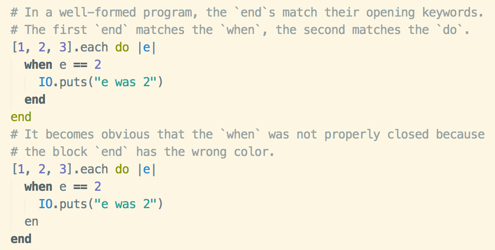

# Myst syntax highlighting for Sublime Text 3

This package provides syntax highlighting for the [Myst programming language](https://github.com/myst-lang/myst).

A primary goal of this syntax definition is to provide as much detail as possible for color schemes and plugins to utilize. This includes:

- **contextual `end` scoping:** `end` is a very common keyword in Myst. It is used to close `do...end` blocks, when chains, loops, exception handlers, types, _and_ modules. As such, it's common to see long chains of `end`s at the end of a file or large block of code, since everything is wrapping up, and it can be hard to figure out what exactly is being closed and where.

  Moreover, it can be hard to spot errors with closing code blocks leading to the infamous "Unexpected EOF..." in Ruby, for example.

  In an attempt to mitigate these issues and improve clarity, this syntax definition provides those `end`s with proper scopes based on what they are closing. For example, an `end` that closes a `when` chain will have the scope `keyword.conditional.end.myst`, while an `end` that closes an exception handler will have a `keyword.control.exceptions.end.myst` scope instead.
  
  

# Installation

Since the syntax of Myst is not necessarily well-defined yet, this package has not been published to the main Package Control channel. To install the package, add the repository to Package Control (see the "Add Repository" section at https://packagecontrol.io/docs/usage) with the url https://github.com/myst-lang/sublime-myst.

Once the repository has been added, you should be able to install the package as normal through Package Control. It will be under the name `sublime-myst`.
